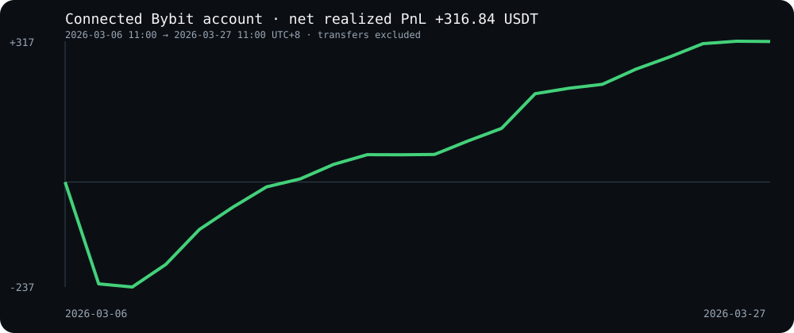

<div align="center">

# zenTrade Grid Lab

**Run an adaptive crypto grid backtest in one minute. No exchange account. No API key.**

[](https://github.com/aycfundteam/zentrade/actions/workflows/test.yml)
[](LICENSE)
[](https://www.python.org/)

[Run the demo](#run-it) · [Read the method](docs/METHODOLOGY.md) · [Competition context](docs/COMPETITION.md) · [Try zenTrade](https://zentrade.me/register?tier=starter&utm_source=github&utm_medium=oss&utm_campaign=zentrade_grid_lab&utm_content=readme_hero)

</div>



This repository turns the strategy ideas behind AYC Fund's Bybit AI trading work into a small, inspectable research project. It includes a two-sided ATR grid, EMA bias, four market regimes, margin limits, fees, slippage, a deterministic BTCUSDT sample, and machine-readable output.

It is deliberately separated from the production zenTrade engine. The public implementation is useful on its own, while live exchange connectivity, monitoring, recovery, and managed operations are part of [zenTrade](https://zentrade.me/?utm_source=github&utm_medium=oss&utm_campaign=zentrade_grid_lab&utm_content=readme_intro).

## Run it

```bash
git clone https://github.com/aycfundteam/zentrade.git
cd zentrade
python -m venv .venv
source .venv/bin/activate
python -m pip install -e .
zentrade demo
```

The command writes four inspectable files to `artifacts/demo/`:

```text
report.md     human-readable result and limitations
result.json   metrics, parameters, dataset window, assumptions
trades.csv    every modeled position close
equity.svg    shareable equity curve
```

Verify the bundled dataset before running it:

```bash
zentrade verify-data
```

Rebuild the sanitized account-evidence report and chart:

```bash
zentrade evidence
```

Run your own chronological OHLCV CSV:

```bash
zentrade backtest --csv your_btc_1h.csv --output artifacts/mine
```

Required columns are `timestamp,open,high,low,close,volume`. The timestamp must be ISO 8601 and rows must be strictly chronological.

## What the demo makes explicit

- Signals use only earlier bars; orders are created from the previous close and indicators.
- If a candle touches both stop and take-profit, the simulator records the stop first.
- Every entry and exit includes configurable fees and slippage.
- A margin guard caps modeled margin at 50% of current cash.
- Results are compared with buy and hold over the same post-warm-up window.
- The bundle identifies its data window and assumptions in JSON.

The bundled 504-hour sample comes from Bybit's public V5 kline endpoint for BTCUSDT over **[2026-03-06 03:00 UTC, 2026-03-27 03:00 UTC)**, the UTC form of the event window supplied by Bybit. Its SHA-256 digest is pinned in [`manifest.json`](src/zentrade/data/manifest.json).

### The current public result

| Metric | Bundled research demo |
|---|---:|
| Strategy return | **-1.46%** |
| Buy and hold | +3.56% |
| Maximum drawdown | 2.62% |
| Closed modeled trades | 138 |

The public reimplementation loses on this sample. That result is kept visible because an open-source release should be falsifiable. The winning live-account record and this simplified bar simulator are different evidence surfaces.

If you improve the demo, keep the costs and stop-first rule, publish the exact command, and validate on another untouched window. A higher score on this one CSV alone is parameter fitting, not progress.

## Competition context

Bybit's official material confirms that AYC Fund was one of six institutional participants and that the public event ran March 6–27, 2026. AYC's competition record lists its AI division result as **#1 with +14.82%**. A separate read-only reconstruction of the connected account window produced **+14.13% simple realized return**; timing boundaries, transfers, unrealized PnL, and leaderboard methodology can explain the difference.

Those figures describe the competition account. They are not the output of this repository. See [the evidence boundary and calculation notes](docs/COMPETITION.md).

## Built for people and coding agents

There are no notebooks, hidden services, or required credentials. An agent can install the package, run a deterministic command, read `result.json`, change one parameter, and show the diff.

Try this prompt in your coding agent:

```text
Clone aycfundteam/zentrade, run `zentrade demo`, inspect result.json and
trades.csv, then change one risk parameter and explain the effect without
claiming the backtest predicts live returns.
```

See [`examples/agent-workflow.md`](examples/agent-workflow.md) for a structured experiment.

## From the lab to the full experience

The open-source lab covers research and reproducibility. [Create a zenTrade account](https://zentrade.me/register?tier=starter&utm_source=github&utm_medium=oss&utm_campaign=zentrade_grid_lab&utm_content=readme_full_experience) when you want the hosted product experience: guided setup, exchange connections, managed strategy lifecycle, monitoring, and product support.

## Contributing

Good first contributions include execution-model tests, alternative public datasets, regime visualizations, and comparisons that hold the data window constant. Read [CONTRIBUTING.md](CONTRIBUTING.md), then open an issue or pull request.

## Risk and scope

This software is for research and education. It does not connect to an exchange or place orders. Backtests simplify execution and can overstate live performance. Cryptocurrency and leveraged trading can result in substantial loss. Past performance does not predict future results.

## License

Apache License 2.0. See [LICENSE](LICENSE).
